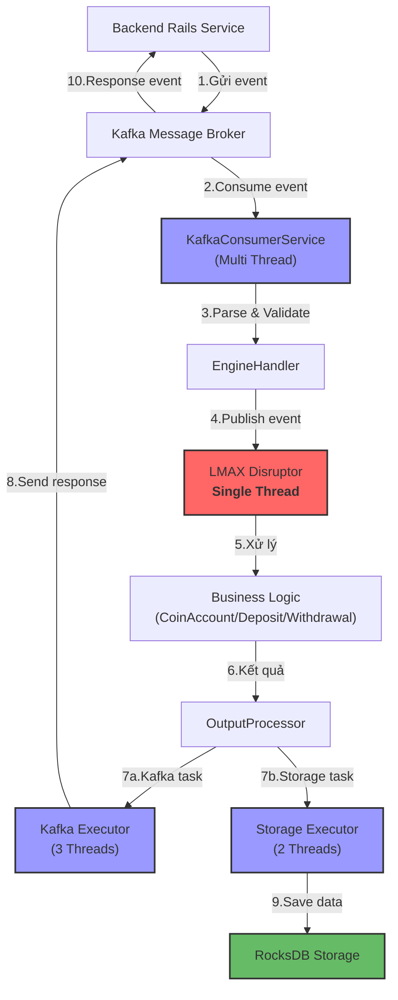

# Sơ đồ Luồng Xử lý Sự kiện trong Exchange Engine

Sơ đồ trên mô tả luồng xử lý sự kiện từ khi Backend gửi event đến Exchange Engine, qua quá trình xử lý bằng LMAX Disruptor, và trả kết quả về Backend.

## Đặc điểm chính

- **Single Thread Processing**: LMAX Disruptor xử lý tất cả các sự kiện bằng một thread duy nhất (màu đỏ)
- **Multi-Thread I/O**: Các hoạt động I/O được xử lý bởi nhiều thread riêng biệt (màu xanh)
- **Storage**: Dữ liệu được lưu trữ vào RocksDB (màu xanh lá)

## Màu sắc

- **Đỏ**: Xử lý single-thread
- **Xanh dương**: Xử lý multi-thread
- **Xanh lá**: Lưu trữ dữ liệu
