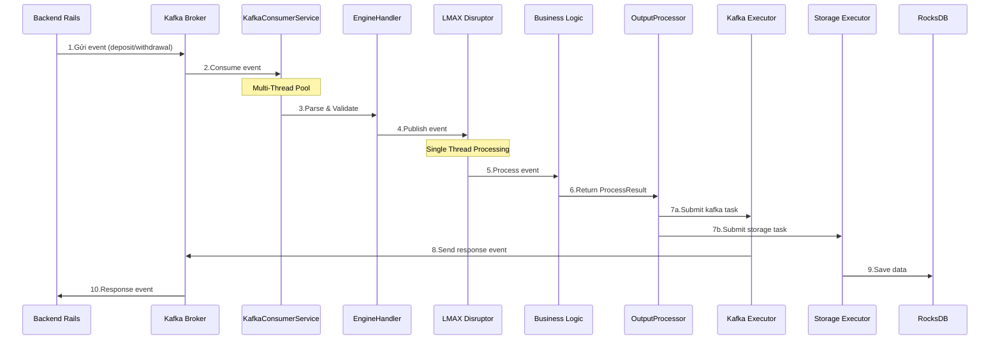

# Sơ đồ Sequence Xử lý Sự kiện trong Exchange Engine

Sơ đồ sequence này mô tả chi tiết quá trình xử lý tuần tự từng bước từ khi nhận sự kiện đến khi trả kết quả.

## Luồng xử lý chính

1. **Nhận sự kiện**: Backend gửi event qua Kafka và được KafkaConsumerService nhận
2. **Xử lý ban đầu**: Event được xác thực và chuyển đến EngineHandler
3. **LMAX Disruptor**: Xử lý sự kiện bằng một luồng duy nhất, đảm bảo tính tuần tự
4. **Xử lý đầu ra song song**:
   - Gửi kết quả đến Kafka
   - Lưu trữ dữ liệu vào RocksDB
5. **Trả kết quả**: Phản hồi được gửi lại cho Backend

## Lưu ý quan trọng

- Phần xử lý logic nghiệp vụ được thực hiện bởi một thread duy nhất
- Các hoạt động I/O (Kafka, Storage) được xử lý bởi các thread pools riêng biệt
- Mô hình này kết hợp tính đơn giản của xử lý đơn luồng và hiệu suất của xử lý đa luồng
